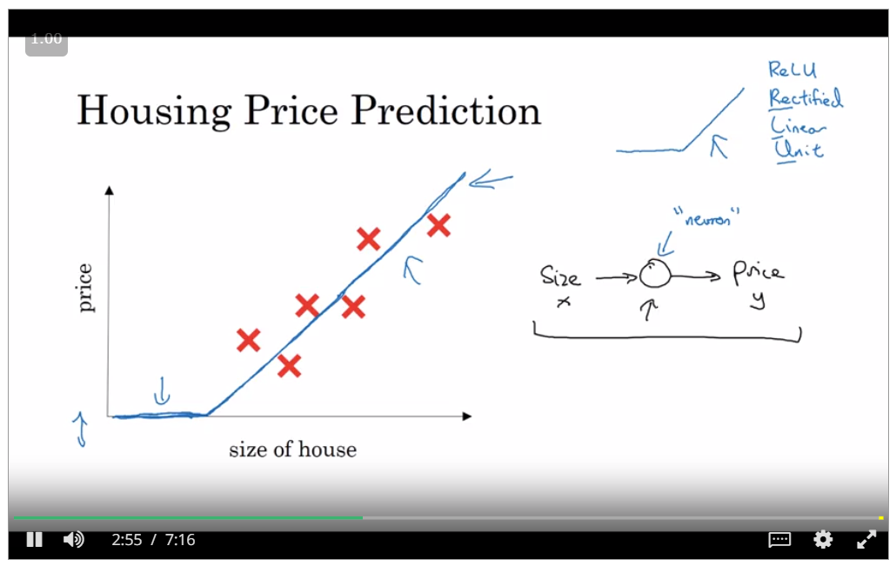
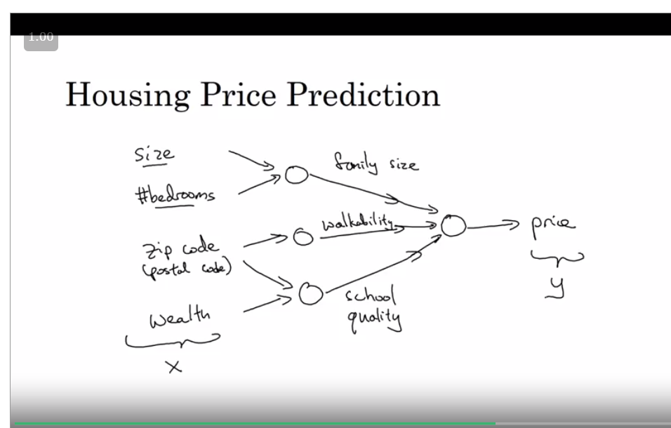
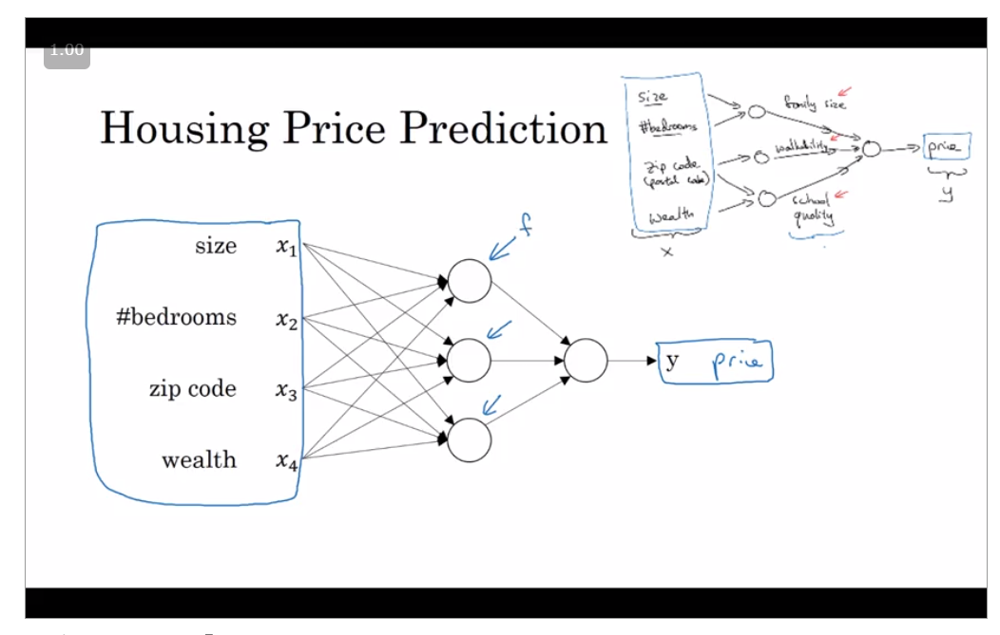

#Deep Learning
>It refers to build neural network with many hidden layers.

###A Simple Perceptron

I only takes a input and applies an activation Function to it. Just one neuron or a perceptron.

------------------------------

**This function that our perceptron represent is called a Relu function or a Rectifier Linear Unit Function**

**Suppose we have many features so we can extend this concept and add various input**

>All the weights it figure out itself. We just give input and the output.

