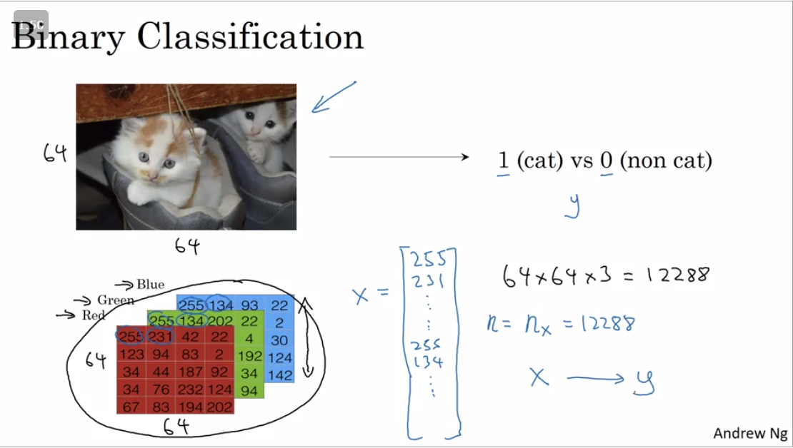

#Binary Classification

* *WE do not use for loops to process each training example. We process the entire training data simultaniously.*
* *WE can break down any Neural Network in 2 steps*
  * Forward Pass
  * Backward Pass 

----
Any Image is represnted as 3 matrices (Each for RGB)


##Notation That we will use: 

>A single training example:
$(x,y)$  _Where_  $x\epsilon\real^{n_x},y\epsilon\{0,1\}$
Here x and y is the training example
>We assing m as the number of examples so:
$m : (x^1,y^1)...(x^m,y^m)$
Training and testing sets can also be denoted as
$M_{train}$ For Training examples
$M_{test}$ For Testing examples

For more mathematical notation and for the easier use for computer we denote and use it in matix form 

$$\begin{matrix}
|&|&&|\\
x^1 & x^2&.. & x^m\\
|&|&&|\\
\end{matrix}$$
>This matrix is $n_x\times m$
>$X\epsilon\Reals^{n_x\times m}$

```python
X.shape= (n*m)
```
*The shape of Y*
>$Y\epsilon\Reals^{1,m}$
$\begin{matrix}
Y = y^1 & y^2&.. & y^m\\
\end{matrix}$

```python
    Y.shape=(1,m)
```