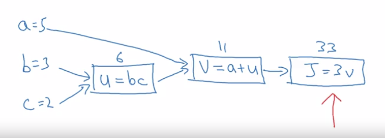
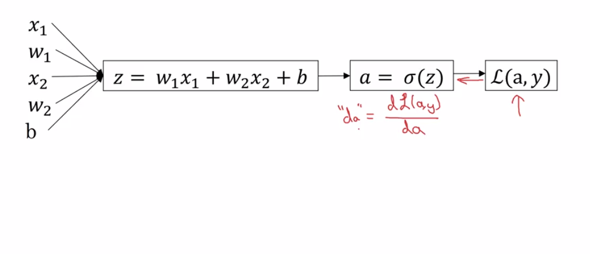

#Computational Graph

$J(a,b,c)=3(a+bc)$
$u=bc\\
v=a+u\\
J=3v$
####A computational graph of the above function


###Computing derivatives
* Let us we want to find $\frac{dJ}{dv}$
Here we can see that: $J=3v$
$\frac{dJ}{dv} = 3$
* $\frac{dJ}{da}$:
  $\frac{dJ}{da} = \frac{dJ}{dv}\times\frac{dv}{da}$
* $\frac{dJ}{du}$:
  $\frac{dJ}{du} = \frac{dJ}{dv}\times\frac{dv}{du}$
* $\frac{dJ}{db}$:
  $\frac{dJ}{db} = \frac{dJ}{dv}\times\frac{dv}{du}\times\frac{du}{db}$
>Just apply the chain rule.

#Logistic Regression Gradient Descent 
> With only one training example

Given Equations
$z=w^Tx+b$
$\hat{y}=a=\sigma(z)$
$L(a,y)=-(y\log(a)-(1-y)\log(1-a))$

Let us take only 2 features
* X1
* W1
* X2
* W2
* b

*Computational Graph*:


$"da"=\frac{dL(a,y)}{da}$
$=-\frac{y}{a}+\frac{1-y}{1-a}$
`Now we must find the derivative w.r.t z it w.r.t to find w1 w2 and b`

$dz = \frac{dL}{dz}$
$dz = \frac{dL}{da}\times\frac{da}{dz}$
$dz = a-y$

`Now`
$\frac{dL}{dw1}=x_1dz$
$\frac{dL}{dw2}=x_2dz$
$db=dz$

####Now the GD algo
$w_1=w_1-\alpha dw1$
$w_2=w_2-\alpha dw2$
$b  =b - \alpha db$

>With many training example


##Logistic Regression on m examples

$J(w,b)={\frac{1}{m}}{\sum_{i=1}^{m}L(a^i,y)}$
>Now the Loss
${\frac{\partial}{\partial wi}}J(w,b)={\frac{1}{m}}{\sum_{i=1}^{m}{\frac{\partial}{\partial wi}}L(a^i,y)}$
$a^i=\hat{y}^i=\sigma(z^i)=\sigma(w^Tx^i+b)$

*The algo for Gd:*
```python
    J=0
    dw1=0
    dw2=0
    db=0
    for i in range(m):
        z[i] = w.T*x[i] + b
        a[i] = sigma(z[i])
        Jt=-[y[i]*log(a[i])+(1-y[i])log(1-a[i])]
        dz[i]=a[i]-y[i]
        dw1 += x1[i]*dz[i]
        dw2 += x2[i]*dz[i]
        db  += dz[i]
    J/=m
    dw1/=m
    dw2/=m
    db/=m
```
> *Here $dw1 = \frac{\partial J}{\partial w1}$*
> So dw1 calculated from above give us the Total value of $\frac{\partial J}{\partial w1}$
> Similar for dw2 and db

*Now update the weights: *
```python
    w1 = w1 - alpha*dw1
    w2 = w2 - alpha*dw2
    b  = b - alpha*db
```