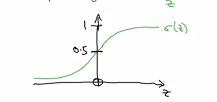
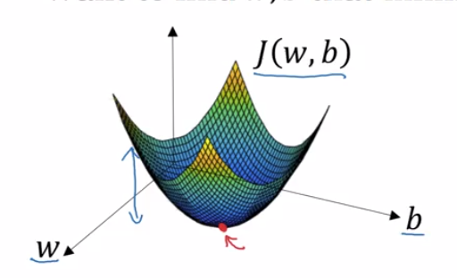
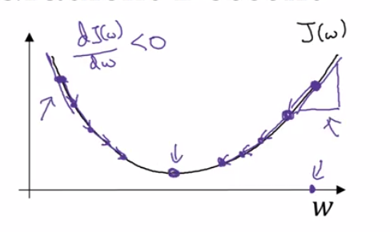

###Given x, want $\hat{Y}=P(y=1|x)$
__Where__
* $x\epsilon{\reals}^{n_x}$
* Parameters: $w\epsilon\reals^{n_x}, b\epsilon\reals$
* Output: $\hat{y}=\sigma(w^Tx+b)$

* We Signifi $w^Tx+b$ as z
* $$\sigma(z)={a\over{1-e^{-z}}}$$
##Logistic Regression cost function.
$\hat{y}=\sigma(w^Tx+b)$ where $\sigma(z)={1\over{1+e^{-z}}}$
Given {${(x^1,y^1),...,(x^m,y^m)}$}, want $\hat{y}^i \eqsim y^i$
`Loss Function`:
>$L(\hat{y},y)=-(y\log(\hat{y})-(1-y)\log(1-\hat{y}))$
>`We do this because we want our loss to be as large as possible.`

`Loss function give us the error in a single training example whereas cost function give us the mean`
##Cost Function:
$J(w,b)={1\over{m}}\sum_{n=1}^{m}L(\hat{y}^{i},y)$
$J(w,b)={1\over{m}}\sum_{n=1}^{m}[-(y\log(\hat{y})-(1-y)\log(1-\hat{y}))]$

##Gradient Descent
We want to find w,b that minimize $J(w,b)$

 `The barebone gd algo`:

> w = w - $\alpha\frac{\partial J(w,b)}{\partial w}$
> b = b - $\alpha\frac{\partial J(w,b)}{\partial b}$
`Here alpha is the learning rate.`

`An Example`

